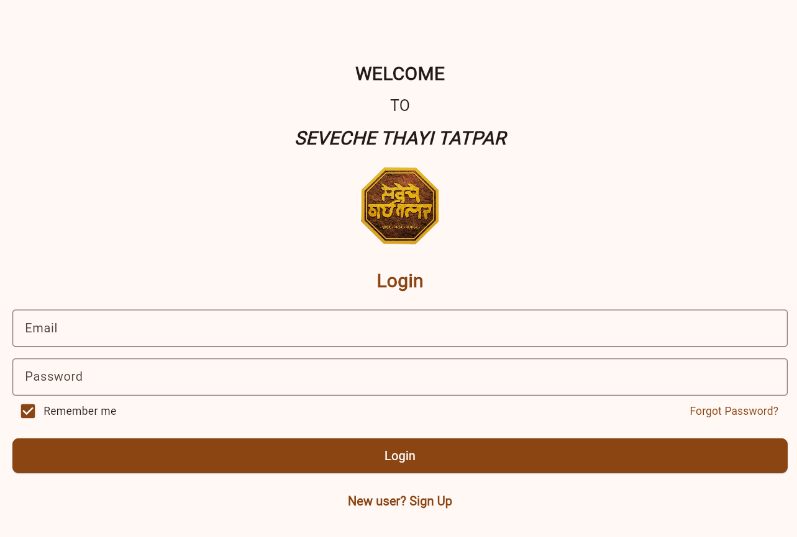

# STT App V2

STT App V2 is a Flutter-based digital platform developed for **Seveche Thayi Tatpar (STT) NGO** to support donations, fundraising campaigns, merchandise sales, event management, and volunteer engagement.

## Project Information

* **Project Type:** Team Project
* **Organization:** Seveche Thayi Tatpar (STT) NGO
* **Technology Stack:** Flutter, Firebase, Firestore, Supabase
* **Current Repository:** Independently maintained and enhanced version

## Team Acknowledgement

This application was originally developed as a team project for Seveche Thayi Tatpar (STT) NGO. This repository contains my independently maintained and enhanced version of the project.

## Features

* User Authentication
* Donation Management
* Event Registration and Tracking
* Merchandise Catalog and Orders
* User Profile Management
* Admin Dashboard
* Campaign and Volunteer Management

## My Contribution

As a member of the project team, I contributed to the application design, documentation, feature implementation, testing, and project presentation. This repository represents my independently maintained version of the project with ongoing improvements and enhancements.

## Future Enhancements

* Improved UI/UX
* Payment Gateway Integration
* Push Notifications
* Admin Analytics Dashboard
* Volunteer Management System
* Campaign Performance Reports

## Screenshots

### Login Page

## Disclaimer

This repository is intended for academic, learning, and portfolio purposes. Any future enhancements and modifications in this repository are independently maintained.
